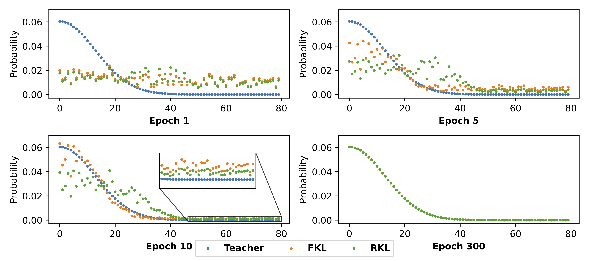

# AKL

This is the offcial github for the paper [Rethinking Kullback-Leibler Divergence in Knowledge Distillation for Large Language Models](https://arxiv.org/abs/2404.02657) from [Taiqiang Wu](https://wutaiqiang.github.io/), Chaofan Tao, Jiahao Wang, Runming Yang, Zhe Zhao, Ngai Wong.

TL,DR: We provide a deeper insight into forward KL and reverse KL in the KD for LLM and then propose a novel AKL based on the analysis.

[Blog](https://zhuanlan.zhihu.com/p/690804722)|[中文版](https://zhuanlan.zhihu.com/p/690748958)

Conclusion:
```
In the KD for LLMs, the mean-seeking and mode-seeking behaviors do not hold for forward KL (FKL) and reverse KL (RKL),respectively. Instead, they share the same optimization objective. Meanwhile, FKL focuses on the head part and RKL focuses on the tail part at the beginning epochs.
```

Converage at begining epochs:


Total process in GIF:


# Toy Examples

To reproduce the toy examples, you can refer to the 
```toy_examples/FR_KL.ipynb``` and ```toy_examples/FR_compare.ipynb```.

# KD Experiments

Please follow the [minillm](https://github.com/microsoft/LMOps/tree/main/minillm) for the environment and dataset.

Introduce the AKL into the KD setting. (Mainly on this [line](https://github.com/microsoft/LMOps/blob/1d6ca760f2f8b712d85bdefae67518c140b8a4a5/minillm/finetune.py#L166))

And then run the experiments and evaluate the student. 

For results on Winogrande, OpenBookQA, BoolQ, ARC, please use [this tool](https://github.com/EleutherAI/lm-evaluation-harness).

# Contact
Taiqiang Wu: takiwu@connect.hku.hk

# Citation
If you find this paper useful, please cite it by using the following BibTeX entry.

```
@article{wu2024rethinking,
  title={Rethinking Kullback-Leibler Divergence in Knowledge Distillation for Large Language Models},
  author={Wu, Taiqiang and Tao, Chaofan and Wang, Jiahao and Yang, Runming and Zhao, Zhe and Wong, Ngai},
  journal={arXiv preprint arXiv:2404.02657},
  year={2024}
}
```
